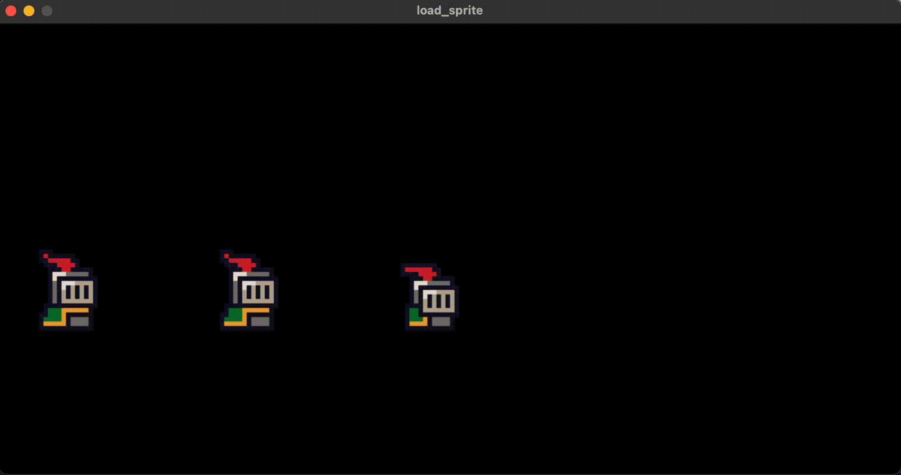

<div align='center'>


</div>

<br />

<div align='center'>

Saohime Engine is a 2D game engine for Nim Programming Language.

</div>

> [!NOTE]
> This project is under heavy development and **NOT** ready for practical use. Some features have not yet been implemented. See Roadmap for more details.

## Supported platforms
- MacOS
- Linux (Ubuntu)
- Windows (Haven't tested yet, but should work on it)

## Requirement
- SDL, SDL_image, SDL_ttf (2.x)
- OpenAL (1.x)
<br>

For those who use devbox to set up a dev environment:
<br>
You can install Nim, nimble and the required libraries above by devbox! Please install saohime by nimble after that.

## Installation
```sh
nimble install https://github.com/glassesneo/saohime
```

## Usage
```nim
import
  std/[lenientops],
  saohime,
  saohime/default_plugins

# Get the resource of type `Renderer`
# It's a syntax sugar for `let renderer = commands.getResource(Renderer)`
proc setup(assetManager: Resource[AssetManager]) {.system.} =
  let texture = assetManager.loadTexture("knight.png")

  let spriteSheet = SpriteSheet.new(
    texture.getSize(),
    columnLen = 8,
    rowLen = 8
  )

  let
    standingSprite = spriteSheet[0, 4]
    runningSprite = spriteSheet[2..3]
    rollingSprite = spriteSheet[5]

  let spriteList = @[
    standingSprite,
    runningSprite,
    rollingSprite
  ]

  for i in 0..<3:
    commands.create()
      # This bundle attaches `Texture` and `Sprite` to an entity
      .SpriteBundle(texture, spriteList[i])
      # Attach a component
      .attach(Transform.new(
        x = 200f * i, y = 200f,
        scale = Vector.new(5f, 5f)
      ))

proc pollEvent(appEvent: Event[ApplicationEvent]) {.system.} =
  # Receive `ApplicationEvent` which deals with the application's start/stop
  for event in appEvent:
    if event.eventType == Quit:
      # `Application` itself is a resource.
      let app = commands.getResource(Application)
      app.terminate()

let app = Application.new()

proc rotateSpriteIndex(
    # Get the entities that has `Sprite` component
    spriteQuery: [All[Sprite]],
    fpsManager: Resource[FPSManager]
) {.system.} =
  if fpsManager.frameCount mod 3 != 0:
    return

  for sprite in each(spriteQuery, [Sprite]):
    sprite.rotateIndex()

# Load the default plugins --------- it's necessary to create a window!
app.loadPluginGroup(DefaultPlugins)

app.start:
  # In the block of `start`, you can use a special variable `world`
  # to add or register what you need for your app.
  world.registerStartupSystems(setup)
  world.updateResource(Window(size: (1000, 500)))
  world.updateResource(FPSManager(fps: 30))

  world.registerStartupSystems(setup)
  world.registerSystems(pollEvent, rotateSpriteIndex)
```

<div align='center'>



</div>

## Features/Roadmap
### Basic features
- [x] Entity Component System integration with [ecslib](https://github.com/glassesneo/ecslib)
- [x] GPU rendering with SDL2
- [x] Flexible API for image, sprite and tile map
- [x] 2D camera implementation
- [x] 3D Audio operations with OpenAL
- [x] Efficient asset management
- [x] Event queue implementation well-integrated with ECS
- [x] General input device support
- [x] Simple FPS management
- [ ] Hierarchical structure between entities
- [ ] Particle implementation
- [ ] GUI implementation built on ECS
- [ ] Timer implementation
- [ ] Command line tool
- [ ] Save/Load implementation

### Extra features
- [x] Extensible plugin architecture
- [ ] Resource embedding
- [ ] WebAssembly support
- [ ] Lua integration
- [ ] cairo integration
- [ ] Hot reload

## Documentation
Please go see [ecslib](https://github.com/glassesneo/ecslib) for Entity Component System API.
The core application API reference can be seen in [docs/API.md](docs/API.md). Every default plugin will soon have its own API.md.

## License
Saohime Engine is licensed under the MIT license. See COPYING for details.

