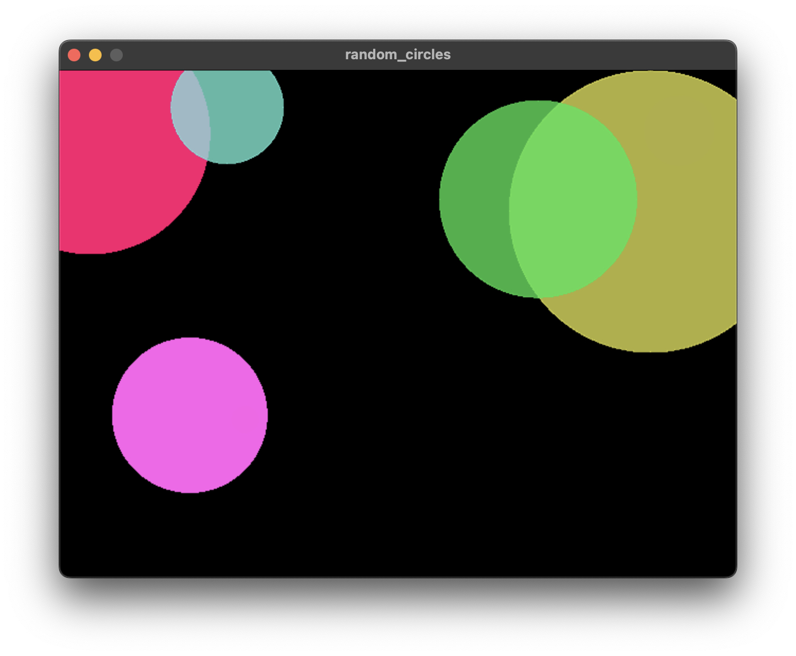

<div align='center'>


</div>

<br />

<div align='center'>

Saohime Engine is a 2D game engine for Nim Programming Language.

</div>

> [!NOTE]
> Saohime Engine is currently work in progress and **NOT** ready for practical use yet. Some features have not yet been implemented. See Roadmap for more details.

## Requirement
- SDL, SDL_image, SDL_ttf (2.x)
- OpenAL (1.x)<br>

For those who use devbox to set up a dev environment:
You can install Nim, nimble and the required libraries above by devbox! Please install saohime by nimble after that.

## Installation
```sh
nimble install https://github.com/glassesneo/saohime
```

## Usage
```nim
import
  std/[colors],
  saohime,
  saohime/default_plugins

# Get the resource of type `Renderer`
# It's a syntax sugar for `let renderer = commands.getResource(Renderer)`
proc setup(renderer: Resource[Renderer]) {.system.} =
  renderer.setDrawBlendMode(BlendModeBlend)

proc pollEvent(appEvent: Event[ApplicationEvent]) {.system.} =
  # Receive `ApplicationEvent`, which deals with the application's start/stop
  for event in appEvent:
    if event.eventType == ApplicationEventType.Quit:
      # `Application` itself is a resource
      let app = commands.getResource(Application)
      app.terminate()

let app = Application.new()

# Load the default plugins --------- it's necessary to create an window!
app.loadPluginGroup(DefaultPlugins)

# Start the app
app.start:
  # In the block of `start`, you can use a special variable `world`
  # to add or register what you need for your app.
  world.registerStartupSystems(setup)
  world.registerSystems(pollEvent)

  # Create circle
  let circle = world.create()
    .attach(Circle.new(radius = 35))
    .attach(Transform.new(x = 400, y = 300, scale = Vector.new(1, 2)))
    .attach(Material.new(
      fill = colOrange.toSaohimeColor,
      stroke = SaohimeColor.new(a = 0)
    ))
```
<div align='center'>



</div>

## Features/Roadmap
### Basic features
- [x] Entity Component System integration with [ecslib](https://github.com/glassesneo/ecslib)
- [x] GPU rendering with SDL2
- [x] Flexible API for image, sprite and tile map
- [x] 2D camera implementation
- [x] 3D Audio operations with OpenAL
- [x] Efficient asset management
- [x] Event queue implementation well-integrated with ECS
- [x] General input device support
- [x] Simple FPS management
- [ ] Hierarchical structure between entities
- [ ] Particle implementation
- [ ] GUI implementation built on ECS
- [ ] Timer implementation
- [ ] Command line tool
- [ ] Save/Load implementation

### Extra features
- [x] Extensible plugin architecture
- [ ] Resource embedding
- [ ] WebAssembly support
- [ ] Lua integration
- [ ] cairo integration
- [ ] Hot reload

## Documentation
Please go see [ecslib](https://github.com/glassesneo/ecslib) for Entity Component System API.
The core application API can be seen in [docs/API.md](docs/API.md). Every default plugin will soon have its own API.md.

## License
Saohime Engine is licensed under the MIT license. See COPYING for details.

