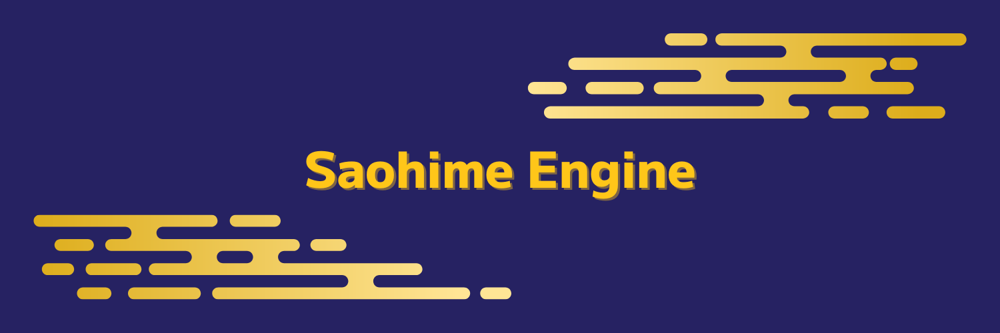

<div align='center'>



</div>

<br />

<div align='center'>

Saohime Engine is a 2D game engine for Nim Programming Language.

</div>

> [!NOTE]
> This project is under heavy development and **NOT** ready for practical use. Some features have not yet been implemented. See Roadmap for more details.

## Supported platforms
- MacOS
- Linux (Ubuntu)
- Windows (Haven't tested yet, but should work on it)

## Requirement
- SDL, SDL_image, SDL_ttf (2.x)
- OpenAL (1.x)
<br>

## Installation
```sh
nimble install https://github.com/glassesneo/saohime
```

## Usage
```nim
import
  std/[random],
  saohime,
  saohime/default_plugins

# Get the resource of type `Renderer`
# It's a syntax sugar for `let renderer = commands.getResource(Renderer)`
proc setup(renderer: Resource[Renderer]) {.system.} =
  randomize()
  renderer.setDrawBlendMode(BlendModeBlend)

proc pollEvent(appEvent: Event[ApplicationEvent]) {.system.} =
  # Receive `ApplicationEvent` which deals with the application's start/stop
  for event in appEvent:
    if event.eventType == Quit:
      # `Application` itself is a resource.
      let app = commands.getResource(Application)
      app.terminate()

proc randomCircles(fpsManager: Resource[FPSManager]) {.system.} =
  if fpsManager.frameCount mod 20 == 0:
    let color = SaohimeColor.new(
      r = rand(255),
      g = rand(255),
      b = rand(255),
      a = rand(255),
    )
    color.r = color.r * 2
    color.g = color.g * 2
    color.b = color.b * 2

    # Create an entity
    commands.create()
      # Attach a component
      .attach(Circle.new(radius = 1))
      .attach(
        Transform.new(x = rand(600f), y = rand(400f), scale = Vector.new(1, 1)),
      )
      .attach(Material.new(color = color))

proc increaseRadius(
    # Get the entities which have `Circle` component
    circleQuery: [All[Circle]]
) {.system.} =
  for entity in circleQuery:
    let circle = entity[Circle]
    circle.radius += 1
    if circle.radius > 150:
      entity.delete()

# Create an instance of `Application`
let app = Application.new()

# Load the default plugins --------- it's necessary to create a window!
app.loadPluginGroup(DefaultPlugins)


# Start the app
app.start:
  # In the block of `start`, you can use a special variable `world`
  # to add or register what you need for your app.
  world.registerStartupSystems(setup)
  world.registerSystems(pollEvent, randomCircles, increaseRadius)

```

<div align='center'>


</div>

## Features/Roadmap
### Basic features
- [x] Entity Component System integration with [ecslib](https://github.com/glassesneo/ecslib)
- [x] GPU rendering with SDL2
- [x] Flexible API for image, sprite and tile map
- [x] 2D camera implementation
- [x] 3D Audio operations with OpenAL via [slappy](https://github.com/treeform/slappy)
- [x] Efficient asset management
- [x] Event queue implementation well-integrated with ECS
- [x] General input device support
- [x] Simple FPS management
- [x] Hierarchical structure between entities
- [ ] Particle implementation
- [ ] GUI implementation built on ECS
- [ ] Support for TUI
- [ ] Timer implementation
- [ ] Command line tool
- [ ] Save/Load implementation

### Extra features
- [x] Extensible plugin architecture
- [x] Lua integration via [spellua](https://github.com/glassesneo/spellua)
- [ ] Resource embedding
- [ ] Test and debug tool
- [ ] WebAssembly support
- [ ] OpenGL integration
- [ ] cairo integration
- [ ] Hot reload

## Documentation
Please go see [ecslib](https://github.com/glassesneo/ecslib) for Entity Component System API.
The core application API reference can be seen in [docs/API.md](docs/API.md). Every default plugin will soon have its own API.md.

## Plugins
### Official
- [Lua Plugin](https://github.com/glassesneo/saohime_lua)

## License
Saohime Engine is licensed under the MIT license. See COPYING for details.

